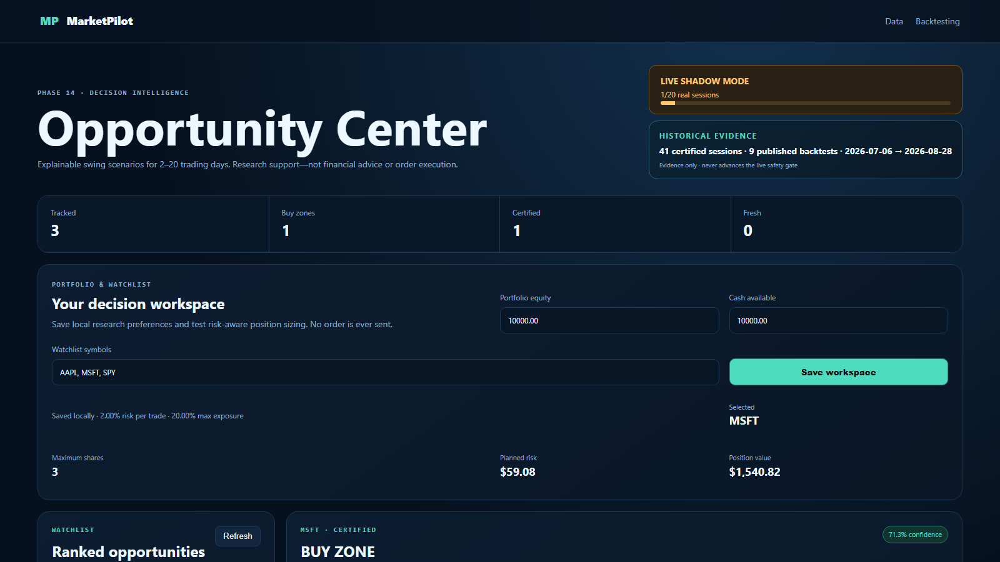

# MarketPilot

[](https://github.com/amihaygr/MarketPilot/actions/workflows/quality.yml)



MarketPilot is a local, reproducible data platform for market research and
explainable decision support. It combines live and historical market data, SEC
company facts, immutable raw storage, governed batch certification, technical and
fundamental features, backtesting, and a browser-based research experience.

It is a research system—not an order-execution platform and not a promise of
profit.

## Start here

- [Explore the complete architecture](docs/architecture/architecture.md)
- [Open the final architecture PDF](docs/architecture/output/MarketPilot.pdf)
- [Download the final presentation](docs/presentation/output/MarketPilot-Final-Presentation.pptx)
- [Follow the Hebrew presentation and live-demo guide](docs/presentation/demo-day-step-by-step-he.md)

## What makes the project different

- Live results remain visibly `PROVISIONAL`; bounded post-market processing
  rebuilds the session and publishes `CERTIFIED` data only after quality gates.
- Every market event retains an immutable Bronze record for replay, lineage and
  failure investigation.
- Decision scenarios separate transparent rule scores, data confidence and
  model probability instead of presenting one ambiguous “confidence” number.
- The hybrid model fails safely to deterministic rules until historical data,
  walk-forward validation, calibration and human approval are complete.

## Final release at a glance

Verified on 17 September 2026:

| Evidence | Verified value |
|---|---:|
| Tracked assets | 11 |
| Gold market bars | 162,743 |
| Certified bars | 154,206 |
| SEC records | 937 |
| Certified historical sessions | 76 |
| Published backtests | 12 |
| v1 live Shadow Mode | 2 / 20 sessions |
| v2 hybrid model | `FALLBACK` |

`FALLBACK` is deliberate. Deterministic v1 rules remain authoritative while the
v2 probability model waits for 24 months of certified data, sufficient entered
scenarios, chronological validation, calibration, a new live Shadow Mode and
human approval. MarketPilot never presents data confidence as a probability of
profit.

## Product surfaces

With the local stack running:

- [Dashboard](http://localhost:3000/) — certified and provisional market data,
  freshness, SEC context, indicators and observations.
- [Opportunity Center](http://localhost:3000/opportunities.html) — watchlist,
  Buy Zone, Stop, Targets, risk-aware position sizing, v1 rules and v2 status.
- [Backtesting Lab](http://localhost:3000/backtesting.html) — published,
  reproducible strategy runs over certified data.
- [Project Story](http://localhost:3000/showcase.html) — the business problem,
  architecture, engineering decisions and measured evidence.
- [Presenter Console](http://localhost:3000/presenter.html) — timed 10, 15 and
  20-minute demo routes with speaker cues and fallbacks.
- [Backend API](http://localhost:8000/docs) — bounded, read-oriented application
  endpoints.

## Architecture

```text
Live
Alpaca -> market-producer -> Kafka -> Spark Structured Streaming
                                  -> MariaDB Gold PROVISIONAL

Raw archive
Kafka -> raw-archive-sink -> MinIO Bronze

Certified batch
Airflow -> Spark Batch -> Bronze -> Silver -> DQ -> Gold CERTIFIED

Historical acquisition
Airflow -> Alpaca IEX -> Kafka Backfill -> Bronze barrier
        -> Silver -> DQ -> Gold -> Backtest

Serving
Browser -> Nginx Web App -> Backend API -> MariaDB Gold
```

Docker Compose owns long-running services. Airflow schedules and monitors bounded
jobs only. The browser never connects directly to MariaDB, MinIO or Kafka.

Read the [complete architecture](docs/architecture/architecture.md), the
[submission PDF](docs/architecture/output/MarketPilot.pdf), and the accepted
[ADRs](docs/decisions/) before changing a data path.

## Quick start on Windows

Copy `.env.example` to `.env` on the first run and replace every required
placeholder locally. Never commit `.env`.

```powershell
Set-Location "C:\Users\Amichai\Documents\naya_college_de\final_project\MarketPilot"
docker compose config --quiet
docker compose up -d
docker compose ps
```

The first startup can take several minutes while health checks settle. The
finite initialization services may exit successfully; this is expected.

## Presentation-day command

Run each line separately:

```powershell
Set-Location "C:\Users\Amichai\Documents\naya_college_de\final_project\MarketPilot"
docker compose up -d
.\scripts\demo-preflight.ps1 -OpenPages
```

The preflight validates Compose, 18 required runtime services, 12 presentation
interfaces, application APIs, current evidence, the daily DAG and Airflow import
status. It opens pages only after every required check passes.

The canonical talk track is the Hebrew
[presentation and live-demo guide](docs/presentation/demo-day-step-by-step-he.md).
The final deck is
[MarketPilot-Final-Presentation.pptx](docs/presentation/output/MarketPilot-Final-Presentation.pptx).

## Engineering interfaces

| Interface | URL | Purpose |
|---|---|---|
| Airflow | <http://localhost:8080/> | DAGs, bounded runs, retries and logs |
| Kafka UI | <http://localhost:8085/> | Topics, partitions, offsets and event payloads |
| MinIO | <http://localhost:9001/> | Bronze, Silver, checkpoints and model artifacts |
| Spark master | <http://localhost:18080/> | Cluster and application state |
| Spark worker | <http://localhost:18081/> | Executors and worker resources |
| Adminer | <http://localhost:8086/> | Local development inspection of MariaDB |

Credentials stay in the ignored `.env`. Do not expose them in screenshots,
slides, logs or screen sharing.

## Quality gates

The project test image contains the exact development dependencies:

```powershell
docker compose --profile tools run --rm --build test-runner
docker compose --profile tools run --rm test-runner sh -c "ruff check . && ruff format --check ."
docker compose config --quiet
```

The final release passed 113 tests; seven opt-in integration suites remain gated
by their documented environment flags. Their live boundaries were also exercised
through Compose health checks, API probes, Airflow inspection and the final demo
preflight.

## Repository map

| Path | Responsibility |
|---|---|
| `AGENTS.md` | Binding engineering and architecture rules |
| `docs/architecture/` | Architecture source, diagrams and final PDF |
| `docs/decisions/` | Accepted architecture decisions |
| `docs/presentation/` | Final deck, guide, glossary, Q&A and rehearsal aids |
| `docs/runbooks/` | Operations, recovery and incident procedures |
| `airflow/dags/` | Bounded orchestration workflows |
| `spark/jobs/` | Streaming and batch Spark jobs |
| `services/` | Long-running producers and archive consumers |
| `src/marketpilot/` | Contracts and reusable business logic |
| `db/migrations/` | MariaDB Gold schema and read models |
| `web/` | Dashboard, Opportunity Center, Backtesting and presentation UI |
| `tests/` | Unit, contract and opt-in integration tests |

## Decision Intelligence safety model

- v1 rules determine price levels, risk gates and explainable scenario status.
- `Rule Score` summarizes transparent technical and fundamental evidence.
- `Data Confidence` measures freshness, coverage and source quality.
- `Model Probability` exists only when a trained, calibrated and promoted model
  artifact is available.
- Missing or invalid model artifacts produce `FALLBACK`; stale probability is
  never reused.
- No component connects to brokerage balances or sends an order.

## Non-goals of the final project

- automated trade execution;
- guaranteed returns or personalized financial advice;
- presenting IEX as a complete SIP market feed;
- calling provisional data certified;
- promoting v2 before its evidence gates pass;
- storing raw payloads only in MariaDB;
- automatic deletion of archived history.

See [final release verification](docs/final-presentation-verification.md) for the
dated evidence, test results and presentation boundaries.
